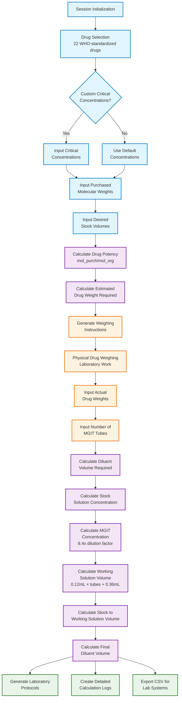

---

title: 'pDST-Calc: A Python package for Phenotypic Drug Susceptibility Testing in Tuberculosis'
tags:
  - Python
  - bioinformatics
  - tuberculosis
  - drug-susceptibility
  - laboratory-automation
  - MGIT
  - command-line-tool
  - pharmaceutical-calculations

authors:
  - name: "Abhinav Sharma"
    orcid: 0000-0002-6402-6993
    equal-contrib: true
    corresponding: true
    affiliation: "1, 2"
    email: abhi18av@outlook.com

  - name: "Bea Loubser"
    orcid: 0009-0000-9837-3339
    equal-contrib: true
    affiliation: 1

  - name: 'Gian van der Spuy'
    orcid: 0000-0002-9067-5903
    email: gvds@sun.ac.za
    affiliation: 1

  - name: 'Emilyn Costa Conceição'
    orcid: 0000-0002-7445-6620
    email: emilyncosta@gmail.com
    affiliation: "1, 3"

affiliations:
  - name: SAMRC Centre for Tuberculosis Research; Division of Molecular Biology and Human Genetics, Faculty of Medicine and Health Sciences, Stellenbosch University, Cape Town, South Africa.
    index: 1
  - name: Centre for Bioinformatics and Computational Biology, Stellenbosch University, Stellenbosch, South Africa.
    index: 2
  - name: Centre for Epidemic Response and Innovation, School of Data Science and Computational Thinking, Stellenbosch University, Stellenbosch, South Africa.
    index: 3

date: 14 August 2024
bibliography: paper.bib

---

# Summary

Phenotypic Drug Susceptibility Testing (pDST) establishes the minimum inhibitory concentrations of anti-TB drugs against *Mycobacterium tuberculosis* (TB) [@WHO2023]. `pdst-calc` is a free Python package that does pharmaceutical calculations for drug dilutions in the Mycobacteria Growth Indicator Tube (MGIT) system [@MGIT2007]. The software is aimed at lab technicians and researchers, by providing a  error-free calculation mechanism through command-line and programmatic interfaces. With eight basic math functions for drug potency, stock solutions, and working dilutions, `pdst-calc` meets the needs of TB testing labs that need to automate calculations that are slow and prone to mistakes when done by hand [@Palomino2008]. The tool works with existing workflows by using CSV formats and detailed logging. It can be used in both interactive and batch processing modes.

# Statement of need

Testing for tuberculosis drug susceptibility requires precise calculations of the amount of drug needed, the concentration of the drug, and the volume of the drug [@WHO2018]. Current laboratory practices depend on manual calculations done with spreadsheets, which may lead to major problems: (1) human error rates of 5–10% in multi-step calculations, (2) lack of standardization across laboratories that makes it hard to reproduce results, (3) setup times of 30–45 minutes that slow down throughput, and (4) a lot of training needed. [@CLSI2011].

<!-- FIXME back up this claim with the right sources -->
<!-- Existing solutions are often expensive, only work on certain platforms, or are only available to certain people.  Open-source alternatives don't have the right validation, documentation, or support for batch processing. -->

Most web-based calculators only do one calculation at a time, not full workflow automation [@TBPortals2019]. In addition, many tools don't meet the needs of the MGIT system or work with laboratory information systems. `pdst-calc` is a complete, tested, and free solution that standardizes calculations, lowers the chance of mistakes through automated validation, reduces the preparation time, and makes integration easier by allowing for different input and output formats.

# Background

The color-coded flowchart below provides the same workflow information. The diagram uses color coding to distinguish different phases:
- **Blue (Input Phase)**: Drug selection, critical concentrations, molecular weights
- **Pink (Calculation Phases)**: Mathematical computations and algorithms
- **Orange (Laboratory Work)**: Physical weighing and data input
- **Green (Output Phase)**: Results generation and export

# Development

The pDST-Calc program is written in Python 3.11+ and uses a modular architecture to separate the core calculations, data management, and user interfaces [@Python2021]. The project has two components: (1) a core library (`pdst-calc-lib`) with math functions and drug database management, (2) a command-line interface (`pdst-calc-cli`) for both interactive and batch processing, both of which are documented on the Github repository.

The architecture uses functional design, with pure functions for calculations that make testing and validation easier. Data management uses pandas to make drug databases and results [@Pandas2020]. The `pdst-calc` has a carefully curated database of 22 anti-TB drugs with molecular weights, diluents, and critical concentrations that meet WHO standards [@WHO2018]. The database can be customized by users who wish to use a non-standard drug panel.

<!-- FIXME add citation for hypothesis -->
Using pytest, the codebase achieves above 95% code coverage [@Pytest2004] implemented different types of testing such as (i) unit tests (ii) integration tests, and (iii) property-based tests with Hypothesis. Continuous integration has been set up with Github Action to check regressions by using automated testing, linting, and security scanning. Furthermore, package distribution through PyPI keeps semantic versioning and backward compatibility.

Core calculations include adjusting drug potency for changes in purity, estimating drug weight for target concentrations, figuring out the volume of diluent based on actual versus estimated weights, calculating the concentration of stock solutions, calculating the concentration of MGIT solutions using system-specific dilution factors, figuring out the volume of working solutions based on the number of tubes, and making the final dilution. Key formulas use standard pharmaceutical calculations along with MGIT-specific factors, such as the 8.4x dilution factor and the 0.12 mL per tube plus 0.36 mL excess.

# Usage

`pdst-calc-cli` and `pdst-calc-lib` can be installed for Python 3.11 or higher and iusing pip (`pip install pdst-calc-cli`). The software has an interactive command-line interface, can process CSV files in batches, and `pdst-calc-lib` offers a library API for programmatic access for integrating with laboratory systems.

In interactive mode, users are guided through session initialization, choosing a drug from a list of 22 anti-TB drugs, customizing the critical concentration if they want to, entering the molecular weights and stock volumes they bought, and figuring out how much drug they need. After weighing things, users enter the actual weights and the number of MGIT tubes to get the final working solution calculations.

Batch processing helps high-throughput labs by letting them input CSV files and automatically making result files and logs. Outputs include protocols that are ready for the lab, logs of calculations, and CSV summaries for system integration.

Input validation, range checking, unit conversion, and detailed error messages are all parts of error handling. For quality assurance and compliance with the law, all operations log with timestamps and session IDs.

# Discussion

Plans for the future include adding more drugs to the database, making a web interface. The modular architecture makes it possible to add other areas of pharmaceutical calculation in a backward friendly manner.

# Availability

The source code and documentation can be found at https://github.com/GENPATH-bioinformatics/genpath-pdst-calc, licensed under the MIT license.

# Acknowledgement

<!-- Check the GENPATH consortium statement -->

We thank the SAMRC Centre for Tuberculosis Research for their lab expertise, the Centre for Bioinformatics and Computational Biology and the GENPATH consortium at Stellenbosch University for their help with computers, lab technicians for their feedback, the Python community for their contributions (pandas, pytest, hypothesis), and the WHO/CLSI for their standardization guidelines.

# References
